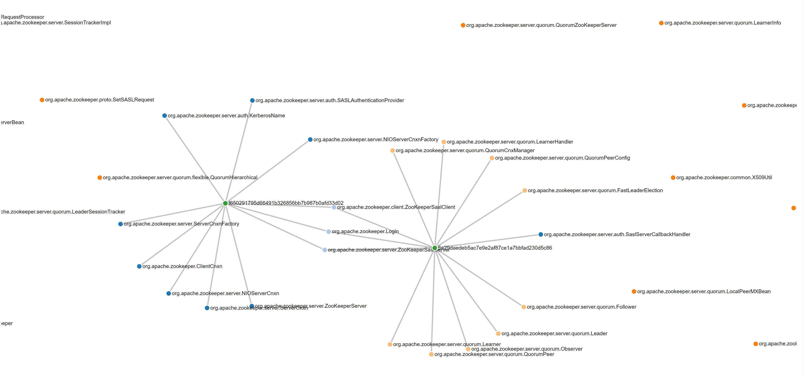

# Recovering Architectural Security Decisions

This repository contains code that extends the ARC architectural recovery technique to identify security related architectural changes in apache zookeeper.

Project Collaborators:
1. [Ameya Kulkarni](https://www.linkedin.com/in/ameyabkulkarni/)
2. [Sonali Gujarathi](https://www.linkedin.com/in/sonaligujarathi/)

## Prerequisite
- Java 8
- ws4j 1.0.1
- lucene-snowball 3.0.1
- jawjaw 1.0.2
- Jackson-core 1.9.11
- Stanford NLP-corenlp 3.6.0
- Debatty Similarity 1.2.1

## Input/Output format and requirements

**Input:**
- ARC output smell file

**Output**:
Clusters in form of JSON dumps
Each cluster has the following information:
  - Commit ID
  - Commit Message
  - Issue ID
  - Potentially security vulnerable files
  - All files affected in the commit

## To Run

1. Build the subject system
2. Run ARC to generate smells file
3. Run the CommandCentral file to for security architecture decision recovery
_Note: Tweak required parameters under the config module_

## Visualization

D3 based clustering

## Info & Acknowledgement
This is repository is part of the project as per the [USC CSCI 578, Fall '19](http://sunset.usc.edu/classes/cs578_2019f/) graduate course.

Please email your questions or comments to [Sarvesh Parab](http://www.sarveshparab.com/).

The ARC recovery algorithm is part of the [ARCADE](https://github.com/asejfia/CS578-arcade) repository

